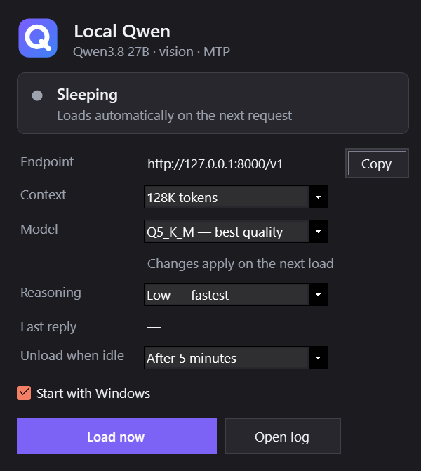
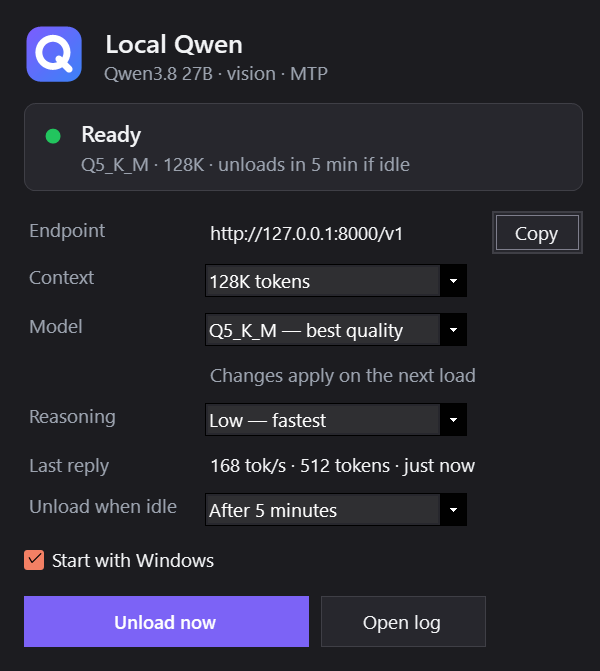

# Model Tray — fast local Qwen on Windows

A small Windows tray app that runs a local LLM with **[llama.cpp](https://github.com/ggml-org/llama.cpp)** directly, behind an OpenAI-compatible endpoint, and loads the model **only when a request arrives**, like Ollama does. It unloads the model again when idle.

On the same model file and GPU it generated **about 2.8× faster than Ollama**:

| Same Qwen3.8 27B Q5_K_M GGUF, RTX 5090, one request, 512 tokens, temperature 0 | Generation speed |
|---|---:|
| Ollama 0.35.0 | 60 tok/s |
| llama.cpp, plain | 62 tok/s |
| **Model Tray (llama.cpp + MTP / n-gram speculative decoding)** | **172–177 tok/s** (up to 676 on copy-heavy edits) |

On real multi-turn coding work (temperature 0.7, varied tasks, 25 min) it averaged a **median of 161 tok/s** (range 117–212). Speed depends on how predictable the text is and drops as a conversation grows: about 108 tok/s with 118K tokens already in context, and 84 tok/s at 252K.

It is **Windows-first** and currently **tuned for Qwen3.8 27B on a 32 GB NVIDIA card**. Everything model- or GPU-specific is in a few clearly marked places, so **feel free to fork it and adapt it** to your model and hardware (see [Customizing](#customizing)).

<p align="center"> &nbsp; </p>

## Why it's faster

Ollama and plain llama.cpp ran at about the same speed. The gain comes from settings that this app turns on for you:

- **Lossless speculative decoding, three ways at once.** (1) Qwen3.8's built-in *multi-token prediction* head drafts 5 tokens ahead; (2) *n-gram lookup* drafts long runs copied from the context — file edits and echoed tool output went from 174 to 365–385 tok/s at 48K context (676 tok/s on a short file edit); (3) *probabilistic drafting* with rejection-sampled verification matches sampled output (temperature > 0), +6–14% on thinking and answers. The model verifies every drafted token, so output quality is unchanged.
- **MTP speculative decoding.** Qwen3.8 ships with a built-in *multi-token prediction* head. llama.cpp's `--spec-type draft-mtp` uses it to draft 5 tokens ahead, and the main model checks them in one pass. No separate draft model is needed. A draft depth of 5 measured fastest; 4, 6 and 7 were all slower.
- **CUDA graphs stay on.** Disabling them (`GGML_CUDA_DISABLE_GRAPHS=1`, a common "stability fix") cost 28% (174 → 125 tok/s) in an isolated A/B test.
- **Everything on the GPU**, including the token-embedding table that llama.cpp otherwise leaves in system RAM, with flash attention and a 4-bit KV cache.
- **No memory-mapping.** `--load-mode none` means the 18.6 GB weights file doesn't also sit in system RAM after it has been copied to VRAM. With the default mmap, idle RAM use was 19 GB; with this setting it is 0.8 GB.

## How it works

```
 your apps (any OpenAI-compatible client)
        │  http://127.0.0.1:8000/v1  + API key
        ▼
 ┌─────────────────────────────── Model Tray (starts with Windows) ───────────────────────────────┐
 │ gateway on :8000 ── first request? ──► start llama-server, wait until ready (~20 s), then stream │
 │                   ── /v1/models, /health ──► answered without loading anything                  │
 │                   ── idle for N minutes ──► stop llama-server, VRAM freed                       │
 └──────────────────────────────────────────────┬──────────────────────────────────────────────────┘
                                                ▼
                         llama-server on private 127.0.0.1:18081
                         (loads the model files Ollama already downloaded)
```

- **Always listening, loaded on demand.** The tray starts at login and holds port 8000. The first real request starts `llama-server`; the request waits about 20–25 s for the load and then streams normally. After the idle timeout (default 5 min; 1/5/15/30/60 min or never) the model is unloaded. Model-list and health requests never wake the GPU, and several first requests at once share a single load.
- **Uses Ollama's downloads in place.** It reads Ollama's manifests and loads the GGUF blobs directly, so nothing is copied or converted and Ollama keeps working. Every downloaded tag of the configured model (e.g. `q5_K_M`, `q4_K_M`) appears as a choice in the tray.
- **Vision.** If the Ollama model includes a vision projector, it is loaded with `--mmproj`, so image input works.
- **Reasoning: Low / Medium / High.** Qwen3.8's *thinking* text is the slowest part of its output: MTP accepts only about 30% of drafted tokens there, versus 70–90% in answers, so thinking runs at about 70–100 tok/s and answers at 125–160. The tray adds the chosen effort to each chat request (default **Low**, measured 10–20% faster than the template default *xhigh*). It also drops earlier turns' thinking from the history, as Qwen's official template does, so long conversations grow more slowly. Switching takes effect on the next message, with no reload. Clients that set `reasoning_effort` or `preserve_thinking` themselves are never overridden.
- **Fast resume after an idle unload.** Before unloading, the tray saves the open conversation's state to disk (llama.cpp slot save; about 2 GB and 1.4 s at 48K tokens). After the next load it restores it, but only into an engine with the same executable, model and context. So the next message re-reads only its new tokens, not the whole conversation. Measured: resuming a 48K-token conversation took 11.9 s including the model load and re-read 62 tokens, versus 31 s and 48,279 tokens without it.
- **Two requests at once.** Two slots share one KV pool (`-np 2 --kv-unified`; each can still use the whole context), so a short request no longer waits behind a long one. While a cached 48K-token background conversation was generating, a short email request finished in **1.2 s instead of 12.7 s**, and the background job ran 7% slower. The second slot costs about 0.8 GB of VRAM. Choice: Parallel requests 2 / 1.
- **Graceful VRAM fallback.** If the chosen setup doesn't fit, for example while a video editor holds a few GB, the tray first drops to one slot and then to a smaller context (256K → 128K → 96K → 64K) instead of refusing. It never spills into system RAM; the panel shows what was loaded and why.
- **Context 128K or 256K.** 256K is the model's trained maximum. If there isn't enough free VRAM for 256K when the model loads, it falls back to 128K and the panel tells you why. It never spills into system RAM.
- **Checks before and after loading.** Free VRAM is checked first, and a load that doesn't fit is refused with a clear message (HTTP 503). After loading, the log is checked to confirm that all layers, the KV cache and the MTP draft are on the GPU.
- **Safe process ownership.** It only ever stops the `llama-server` it started, tracked by PID, start time and executable. Unknown programs on its ports are never killed.

### The tray

- **Icon dot:** grey = sleeping, amber = loading, green = ready, blue = generating, red = needs attention.
- **Left-click** opens the status panel (shown above). **Right-click** gives the same actions as a menu: Load/Unload now, Context, Model, Reasoning, Parallel requests, Unload when idle, Start with Windows, Copy API endpoint, Copy API key, Connect OpenCode (T3 Code), Open log, Open config folder, Quit.
- Quitting the tray also unloads the model, since clients can't reach it without the tray.

## Requirements

- Windows 10/11 x64 and an NVIDIA GPU. It was built and measured on an RTX 5090 (32 GB); the default model needs about 25 GB of VRAM at 128K context, or about 28.5 GB at 256K.
- [.NET 10 SDK](https://dotnet.microsoft.com/download) to build. The ASP.NET Core 10 runtime is needed to run it.
- A llama.cpp **Windows CUDA** build with MTP support. Tested with releases [b11517](https://github.com/ggml-org/llama.cpp/releases/tag/b11517) (current; 5–14% faster on thinking text than b11429) and [b11429](https://github.com/ggml-org/llama.cpp/releases/tag/b11429): `llama-b11517-bin-win-cuda-13.4-x64.zip`. You may also need `cudart-llama-bin-win-cuda-13.4-x64.zip` unless the CUDA 13 runtime is already installed. Use a Clang-built release; MSVC builds have a known speculative-decoding slowdown on Windows ([#28218](https://github.com/ggml-org/llama.cpp/issues/28218)).
- [Ollama](https://ollama.com), used only to download the model.

## Install

1. **Download the model** (no weights are included in this repo):
   ```
   ollama pull orcarouter/Qwen3.8-27B-Uncensored:q5_K_M    # best quality, ~20 GB
   ollama pull orcarouter/Qwen3.8-27B-Uncensored:q4_K_M    # lighter/faster, ~18 GB (optional)
   ```
   Model pages: [Ollama](https://ollama.com/orcarouter/Qwen3.8-27B-Uncensored) · [Hugging Face](https://huggingface.co/orcarouter/Qwen3.8-27B-Uncensored). This build is *abliterated* (refusals removed; its authors report standard benchmarks within ±1.3 points of the original Qwen3.8 27B). Any Qwen3.8 27B GGUF with its MTP head should work. See [Customizing](#customizing).
2. **Build** (from `src/LocalQwenTray`):
   ```
   dotnet publish -c Release -r win-x64 --self-contained false -p:UseAppHost=true -o publish
   ```
3. **Add llama.cpp**: unzip the llama.cpp build (plus the cudart zip if needed) into `publish\llama.cpp\`, so that `publish\llama.cpp\llama-server.exe` exists.
4. **Run** `publish\LocalQwenTray.exe`. On first run it creates `%LOCALAPPDATA%\LocalQwen\config.json` with a random API key.
5. **Point your client** at `http://127.0.0.1:8000/v1`. Use **Copy API key** in the tray menu for the key, and the model name `qwen3.8-27b-uncensored-q5_k_m`; any name works, since there is one model per server. Enable **Start with Windows** in the tray if you want it there from login.

## Use with OpenCode and T3 Code

[OpenCode](https://opencode.ai) and T3 Code's OpenCode driver can use the tray as a provider.

1. Click **Connect OpenCode (T3 Code)** in the tray menu, or run `LocalQwenTray.exe --connect-opencode`. This adds a `local-qwen` provider to `~/.config/opencode/opencode.json` (with the endpoint, key, vision, reasoning, tool calls and context limit) and keeps every other provider; the original file is backed up once as `opencode.json.before-local-qwen`. A config with comments is never rewritten. The tray keeps the context limit in step with what is actually loaded.
2. In **T3 Code → Add provider instance → OpenCode**, set **Binary path** to `opencode` and leave **Server URL** and **Server password empty**, so T3 starts OpenCode itself. (Server URL is the address of an *OpenCode server*, not of the model.)
3. Pick the model `local-qwen/qwen3.8-27b-uncensored-q5_k_m`, or the `local-qwen` agent. That agent edits files in the project without asking, but must ask you before running a command or using the web (a shell can reach outside the project folder), and it may not touch files outside the project.

## Use Qwen as a sub-agent (MCP)

`LocalQwenTray.exe --mcp` is a [Model Context Protocol](https://modelcontextprotocol.io) server on stdin/stdout. Any MCP-capable agent can then delegate work to the local model. It goes through the tray's gateway, so the model loads on demand, your reasoning setting applies, and with two slots it doesn't block your other Qwen work. Tools:

- `ask_local_qwen(prompt, system?, reasoning?, max_tokens?)`: drafts, summaries, rewrites, simple code, second opinions. `reasoning` is `off` / `low` / `medium` / `xhigh`.
- `ask_local_qwen_about_image(image_path, prompt, ...)`: vision questions about a local image file.
- `run_local_qwen_agent(task, working_directory, check_command?, max_rounds?, timeout_minutes?)`: hands a whole chore to Qwen. It works as an agent in that folder and returns its summary plus the files it changed. With `check_command` (for example `python -m pytest -q`), the server runs that command after Qwen's edits and gives any failure back to Qwen for another round, up to `max_rounds` (default 3). It needs [OpenCode](https://opencode.ai) installed (`npm install -g opencode-ai`) and is meant for well-defined chores: fixing a failing test, adding tests, small refactors, bulk edits.
- `local_qwen_status()`: whether the tray is reachable, plus model and context.

**What the agent may do.** Qwen gets file tools only: read, search and edit inside `working_directory`. Shell commands, sub-agents, web access and other MCP servers are all denied. Edits outside the folder are refused. The policy is passed to OpenCode by the MCP server, and the project's own `opencode.json` is ignored, so Qwen cannot write itself a looser policy. Why no shell: a command allowlist is not a fence. When tested with `echo` blocked, Qwen wrote outside the folder with `python -c` instead. Commands are therefore chosen by the *calling* agent (`check_command`), not by Qwen. That command runs with your permissions and executes code Qwen may have just edited, so in projects you don't trust, review the diff before letting it run. This is a permission boundary inside OpenCode, not an OS sandbox.

Register it with your agent (use the full path to your published exe). The first call can take about 25 s while the model loads, so allow a generous tool timeout (`run_local_qwen_agent` can take up to its `timeout_minutes`, 20 by default):

- **Codex** (`~/.codex/config.toml`):
  ```toml
  [mcp_servers.local-qwen]
  command = 'C:\path\to\LocalQwenTray.exe'
  args = ["--mcp"]
  tool_timeout_sec = 1800
  ```
- **Claude Code**: `claude mcp add local-qwen -- "C:\path\to\LocalQwenTray.exe" --mcp`
- **OpenCode** (`opencode.json`): `"mcp": { "local-qwen": { "type": "local", "command": ["C:\path\to\LocalQwenTray.exe", "--mcp"] } }`

Then tell the agent when to use it, for example: *"Use ask_local_qwen for first drafts and summaries. Hand small, well-defined code chores to run_local_qwen_agent with a check_command, then review its diff."*

## Configuration

`%LOCALAPPDATA%\LocalQwen\config.json` (open it with **Open config folder**; see `config.example.json`):

| Field | Meaning |
|---|---|
| `ApiKey` | Key clients send as `Authorization: Bearer …`. Random on first run. |
| `LlamaServer` | Path to `llama-server.exe`. Default: `<app folder>\llama.cpp\llama-server.exe`. |
| `ChatTemplate` | Optional Jinja template. Empty = the template embedded in the GGUF. The bundled `qwen38-codex-chat-template.jinja` merges multiple system messages, which some agent clients send. |
| `OllamaRepository` | Ollama model to load, e.g. `orcarouter/Qwen3.8-27B-Uncensored` (official library models are `library/<name>`). |
| `ModelName` | Name advertised on `/v1/models`. |
| `ClientSyncCommand` | Optional command run after a load whose context size changed. `{context}` is replaced with the token count. Use it to update your clients' context settings. |

Tray choices (context, model, reasoning, parallel requests, idle timeout) are saved in `settings.json` in the same folder. Logs are in the same folder: `tray.log` and `native-engine.log`.

## Customizing

The defaults are deliberately specific. These are the places to change for another model or GPU:

- **`src/LocalQwenTray/Policy.cs`**: the VRAM needed at 128K/256K (`Q5Need128`, `Q5Need256`, measured on Qwen3.8 27B Q5_K_M with vision), the reference weights size, and the context choices. Re-measure these on your setup; the tray uses them to decide whether a load fits.
- **`src/LocalQwenTray/NativeHost.cs` → `BuildArguments`**: all llama-server flags, including MTP draft depth, KV-cache type, batch sizes and threads. For a model **without** an MTP head, remove the `--spec-*` flags and the MTP lines in `ValidateResidency`.
- **`config.json`**: a different Ollama model, a different llama.cpp build, or your own chat template.

Pull requests are welcome.

## Lessons from building it (Windows + NVIDIA)

- **Don't set "CUDA – Sysmem Fallback Policy: Prefer No Sysmem Fallback"** for `llama-server.exe` in the NVIDIA Control Panel. With a large model resident, it made the whole desktop lag by seconds: the mouse, typing, both monitors. Driver Default fixed it. This app checks VRAM before loading instead.
- **Crashes with "CUDA error: an illegal memory access" during long generations** can be the GPU, not llama.cpp. Check the Windows **System** log for `nvlddmkm` events. On the development machine they were caused by an undervolt curve that boosted to an unstable clock whenever the load dipped. Capping the curve fixed it, with no speed loss.
- **Where the time goes at long context.** At 84K tokens of conversation, answers still ran at 125–140 tok/s, but thinking dropped to 67–88. Lowering the reasoning effort helped more than compacting earlier: going from 16K to 84K costs only about 15–20%. Draft depth 5 stayed best; 2 and 3 were slower overall. An 8-bit KV cache gave no gain for +1.5 GB, and on an RTX 5090 Q4_K_M was *slower* than Q5_K_M — and Q6_K 30–40% slower.
- **Tried and rejected (all lossless, all slower here):** the DFlash2 draft model (z-lab) was 14% slower than MTP + n-gram on the abliterated model and 4% slower on the original. Draft depths 4/6/7 and shorter n-gram matches were within noise or worse. The original (non-abliterated) Qwen3.8 27B was not faster, and Q6_K was 30–40% slower.
- **Prompt re-processing on hybrid models.** Qwen3.8 mixes attention and recurrent layers. Appending to a conversation is cheap, because only the new tokens are processed, but editing earlier history forces a full re-read.

## Tests

`python verify_all.py` (in `src/LocalQwenTray`) builds the app and runs the self-tests. These cover the VRAM policy, launch arguments, process ownership, a real Kestrel gateway against a fake llama-server (auth, on-demand load, live streaming, idle unload, load failures) and real WinForms UI tests. It then publishes and checks the published exe. None of the tests use the GPU.

`LocalQwenTray.exe --ui-preview <folder>` renders the status panel and icons to PNG files.

## License

MIT. See [LICENSE](LICENSE). Model weights and llama.cpp are not included and are covered by their own licenses.
